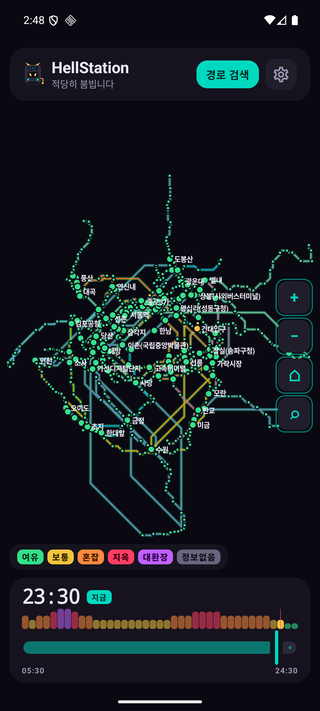
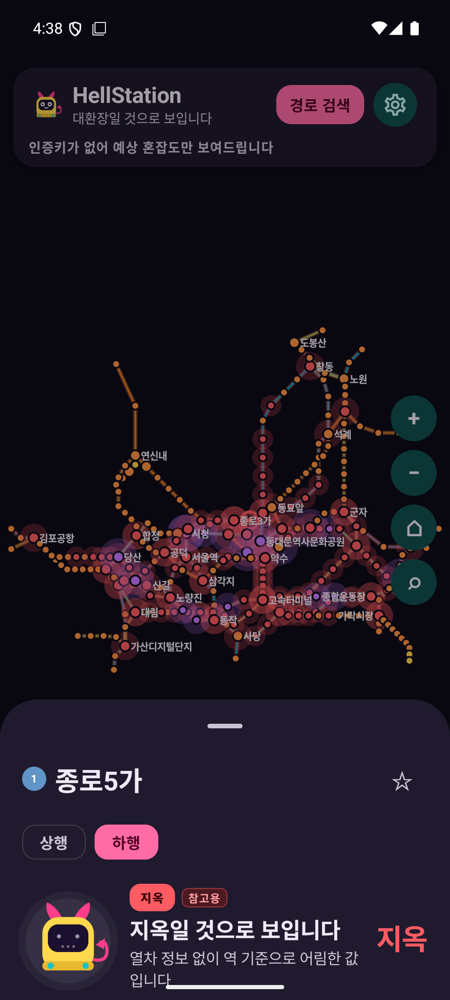
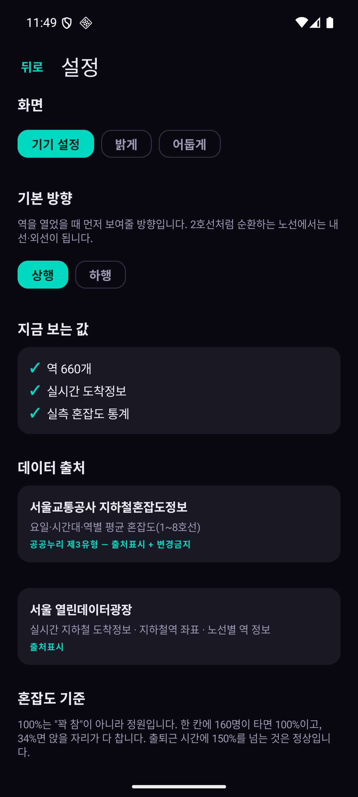

# HellStation 🚇😈

> 지금 저 지하철, 탈까 기다릴까?

서울 지하철 혼잡도를 지도에 색으로 보여주고, **지금 들어오는 열차와 다음 열차 중 어느 쪽이 나은지** 알려 주는 안드로이드 앱입니다.

<p align="center">
  
  
  
</p>

## 무엇을 하나

- **혼잡도 지도** — 역과 구간을 혼잡도 색으로 칠합니다. 가장 심한 구간은 천천히 숨을 쉽니다(깜빡이지 않습니다 — 광과민성 발작 때문입니다).
- **시간 여행** — 슬라이더로 05:30 ~ 24:30 어느 시간대든 미리 봅니다. "내일 8시엔 어떨까"를 오늘 확인할 수 있습니다.
- **탈까 기다릴까** — 지금 열차와 다음 열차의 혼잡도·배차 간격을 견줘 결론을 냅니다. 두 등급 나아져도 8분을 기다려야 하면 그냥 타라고 합니다.
- **역 찾기 · 즐겨찾기** — 출퇴근에 쓰는 역은 별을 눌러 두면 맨 위에 옵니다.

## 이 앱이 지키는 규칙

**모르면 모른다고 합니다.** 어림값에는 절대 정확한 숫자를 붙이지 않습니다.

- 실측 통계가 없으면 신뢰도가 `LOW`로 묶이고, 그러면 **% 숫자를 숨기고 등급 이름만** 보여줍니다.
- 어림값일 때는 캐릭터도 농담하지 않습니다. 담백한 문구로 바뀝니다.
- "지금 오는 열차가 없다"와 "연결이 끊겼다"를 구분해서 말합니다. 앞은 기다리면 되고 뒤는 다시 눌러야 하니까요.

**혼잡도 100%는 "꽉 참"이 아닙니다.** 한 칸 정원 160명이 100%이고, 좌석(54석)만 다 차면 약 34%입니다. 출퇴근에 150%를 넘는 건 정상입니다.

## 데이터 출처

| 출처 | 쓰는 것 | 라이선스 |
|---|---|---|
| 서울교통공사 지하철혼잡도정보 | 요일·시간대·역별 평균 혼잡도 (1~8호선) | **공공누리 제3유형** — 출처표시 + 변경금지 |
| 서울 열린데이터광장 | 실시간 도착정보 · 역 좌표 · 노선별 역 정보 | 출처표시 |

> **공개된 "실시간 혼잡도" API는 없습니다.** 이 앱의 혼잡도는 *통계 평균*에 *실시간 열차 상황*(배차 간격·지연)을 곱해 보정한 값입니다. 그래서 화면이 "참고용 어림값입니다"라고 말합니다.

## 만들고 실행하기

```bash
git clone <이 저장소>
cd Hellstation
./gradlew installDebug
```

인증키가 없어도 **그대로 빌드되고 실행됩니다.** 어림값으로 지도가 칠해지고, % 숫자만 안 나옵니다.

### 인증키를 넣으면

`local.properties`에 (이 파일은 git에 올라가지 않습니다):

```properties
SEOUL_OPENAPI_KEY=일반_인증키
SEOUL_REALTIME_SUBWAY_KEY=실시간_지하철_인증키
```

둘 다 [서울 열린데이터광장](https://data.seoul.go.kr)에서 받습니다. **실시간 전용키는 메뉴가 따로 있고 승인에 1~2일** 걸립니다.

실측 혼잡도 CSV는 [공공데이터포털](https://data.go.kr)에서 **`서울교통공사_지하철혼잡도정보`** 를 받아 `app/src/main/assets/seoul_metro_congestion.csv`에 두면 됩니다. 그때부터 % 숫자가 나옵니다.

> 검색하면 `서울특별시 지하철 혼잡도 통계`도 같이 나오는데 **그건 XLSX라 안 됩니다.** 30분 단위 CSV인 서울교통공사 것을 받으세요.

## 구조

```
domain/    혼잡도 등급 · Ride/Wait 판단 규칙 8가지 · 시간대 계산   (안드로이드 의존 없음)
data/      서울시 API · 통계 CSV · 캐시 · 창구(Facade)
ui/        Compose 화면 · 노선도 렌더링 · 문구
navigation/화면 이동
```

혼잡도 등급을 정하는 곳은 `CrowdLevel.fromPercent()` **한 군데**뿐이고, 말투를 정하는 곳은 `HellCopy.toneFor()` **한 군데**뿐입니다. 규칙이 여러 곳에 흩어지면 화면마다 다른 말을 하게 됩니다.

- `docs/api-validation.md` — API 8개를 **실제로 호출해** 확인한 기록 (샘플 키 5건 제한, 에러일 때 XML이 오는 함정 등)
- `docs/crowding-levels.md` — 등급·신뢰도 기준
- `docs/review-notes.md` — 검토 기록과 고친 것들

## 만듦새

```
Kotlin 72개 · 단위 테스트 65개 · 컴파일 경고 0
Android 8.0(API 26) 이상 · Kotlin 2.4 · Compose
```

## 아직인 것

- **1~8호선만 실측 대상입니다.** 9호선·경의중앙·신분당·공항철도는 통계 파일에 없어서 계속 어림값이고, % 숫자도 안 나옵니다
- 실시간 도착정보는 열차가 다니는 시간(05:30~24:30)에만 나옵니다

## 개인정보

**수집하지 않습니다.** 계정도 위치도 광고도 분석 도구도 없습니다. 설정과 즐겨찾기는 기기 안에만 저장됩니다.

자세한 내용과 한 가지 유의사항(서울시 API가 HTTPS를 지원하지 않습니다)은 [개인정보처리방침](docs/privacy-policy.md)에 적었습니다.

---

_개인 학습용 비영리 프로젝트입니다._
